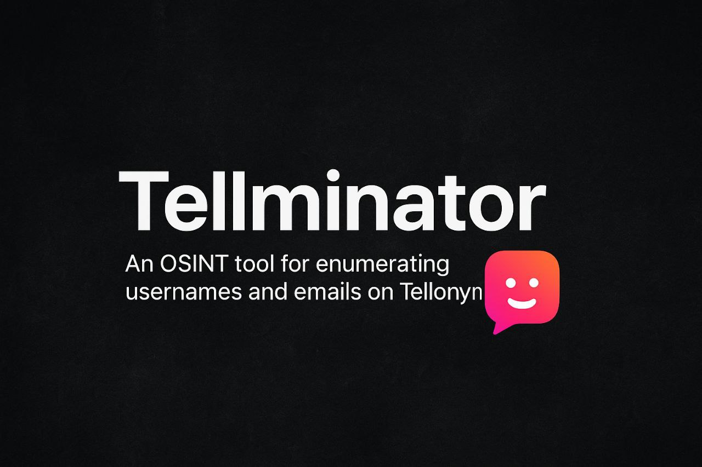

# Tellminator


Tellminator is an OSINT tool for enumerating usernames and emails on Tellonym.  
It checks if your target is there on Tellonym.  

---
<summary><b>🧐Installation</b></summary>

```
git clone https://github.com/povzayd/tellminator.git
cd tellminator
pip install -r requirements.txt
```
###### Requirements
`requests`
`tqdm` 
`colorama`

---
<details>
<summary><b>Usage</b></summary>

###### Check single username:
```
python tellminator.py --username --value johndoe
```
###### Check single email:
```
python tellminator.py --email --value example@mail.com
```
###### Check multiple usernames:
```
python tellminator.py --username --input usernames.txt
```
###### Check multiple emails:
```
python tellminator.py --email --input emails.txt
```
###### Use proxies (rotate every 3 checks):
```
python tellminator.py --username --input usernames.txt --proxyfile proxies.txt --rotate 3
```
###### Save results:
```
python tellminator.py --username --input usernames.txt --log results.log
```
---

###### Example Output
```
[+] Starting Tellonym OSINT scan (username mode)...

✅ johndoe - User Found
🚫 randomname123 - User Not Found
```
---
</details>

##### Disclaimer

*This tool is for OSINT and research purposes only.*                                                                          
Use responsibly. I'm not liable for misuse.

---
##### WANT TO SCRAPE TELLS FROM A PARTICULAR PROFILE? TRY [telloverse](https://sudo6t6.github.io/telloverse)                                                   
##### WHY DON'T YOU TRY [t0xyn](https://github.com/povzayd/t0xyn)
